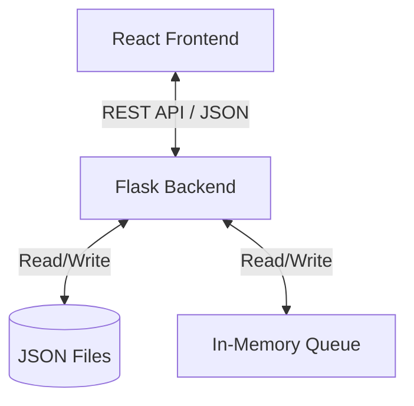

# System Architecture

CareFlo follows a client-server architecture designed for simplicity and ease of deployment.

## High-Level Overview

### 1. Frontend Layer (React)
*   **Framework**: React 18+ (bootstrapped with CRA).
*   **State Management**: Local component state + Context API for Auth.
*   **Routing**: React Router (implied structure).
*   **Styling**: Plain CSS (`App.css`).
*   **Communication**: `fetch` API for network requests.

### 2. Backend Layer (Python/Flask)
*   **Framework**: Flask (Microframework).
*   **Role**: Handles business logic, authentication, and data orchestration.
*   **Security**:
    *   JWT-based session tokens (simple UUID hex tokens stored in memory).
    *   `werkzeug.security` for password hashing (PBKDF2).
    *   CORS enabled for cross-origin requests.

### 3. Data Persistence Layer
The system uses a hybrid approach for data storage:

*   **Persistent Storage (JSON Files)**:
    *   `users.json`: Stores user credentials and profile info.
    *   `prescriptions.json`: Stores medical records/prescriptions.
    *   *Why JSON?* Zero-configuration, easy to inspect, portable for small-scale deployments.

*   **Volatile Storage (In-Memory)**:
    *   `patients_queue`: Active daily queue.
    *   `queues`: Statistics/counts for dashboard.
    *   *Note*: Queue data is reset on server restart, mimicking a daily system reset.

## Key Design Decisions

*   **In-Memory Queue**: To ensure high performance for frequent read/write operations during the booking process, queue positions are held in memory.
*   **Token Authentication**: Simple token mapping allows for stateless-feeling client interactions while maintaining session control on the server.
*   **Multi-Language**: Translations are handled client-side to ensure instant switching without server roundtrips.
